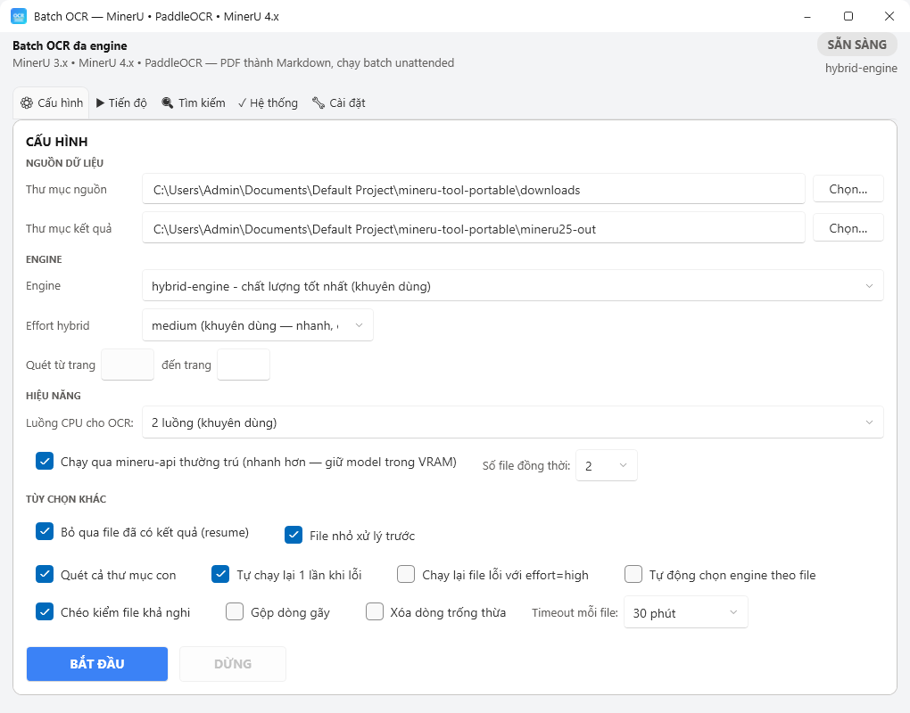
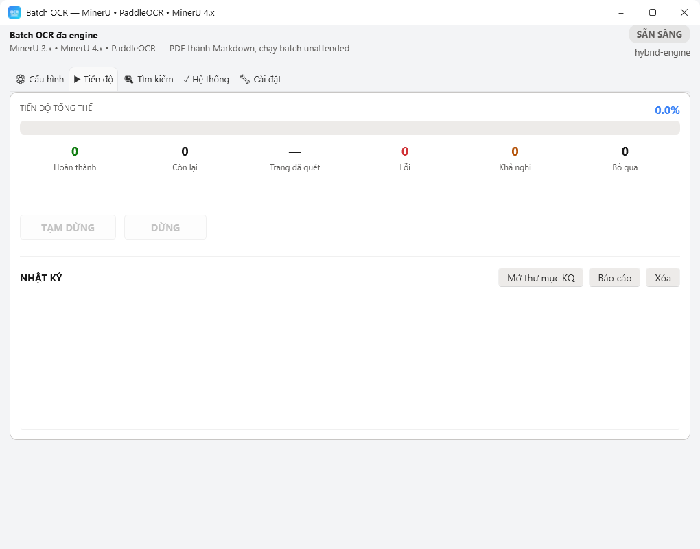
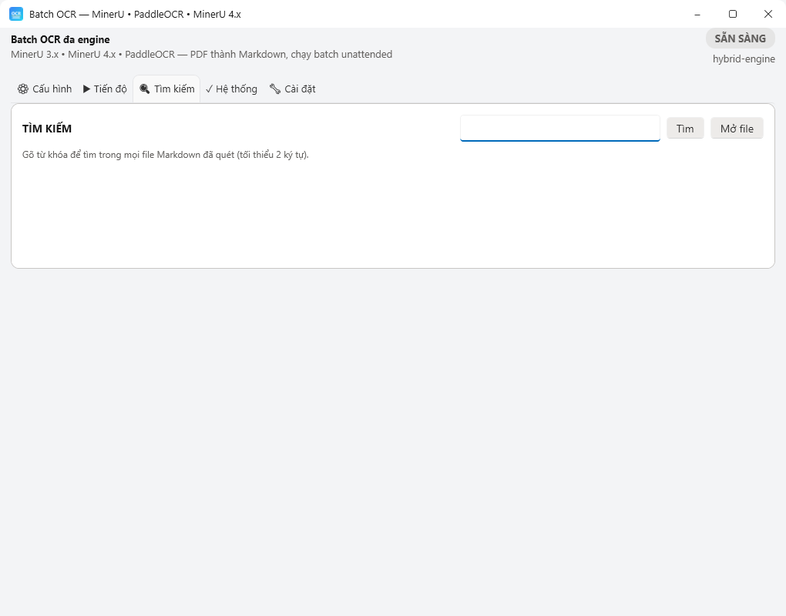
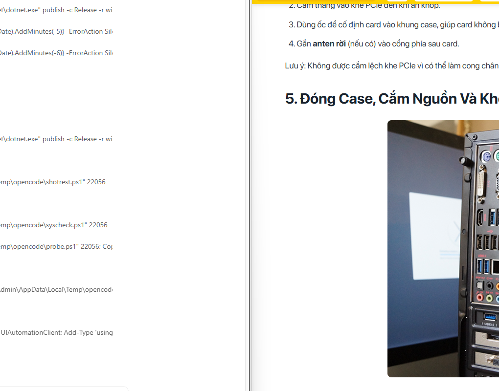
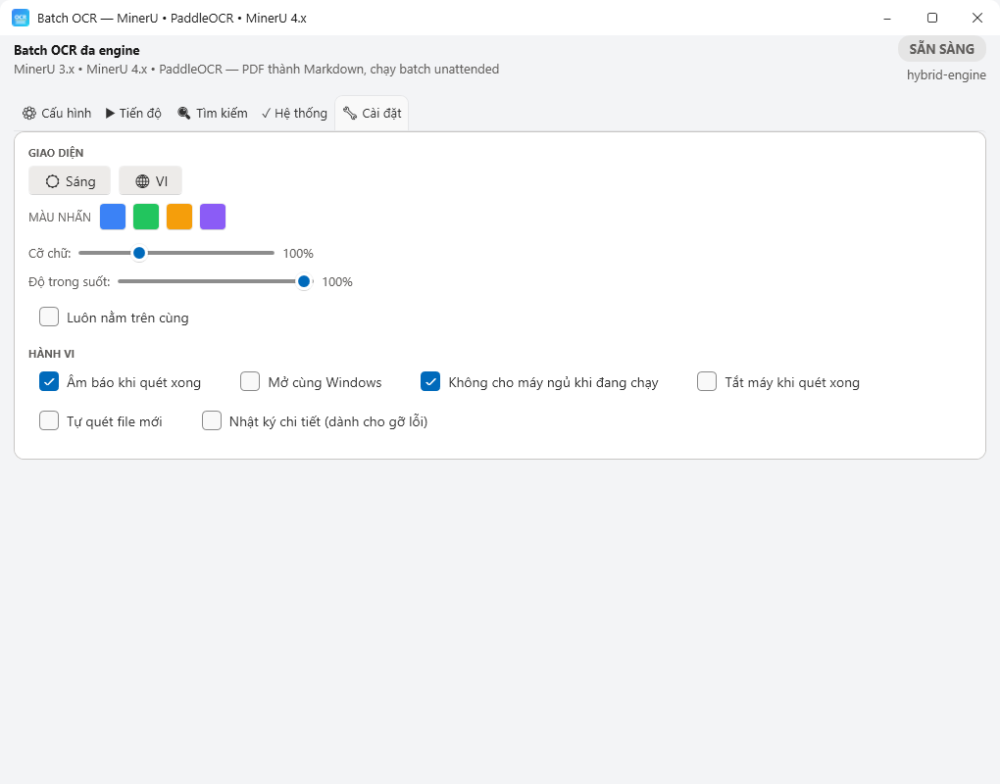
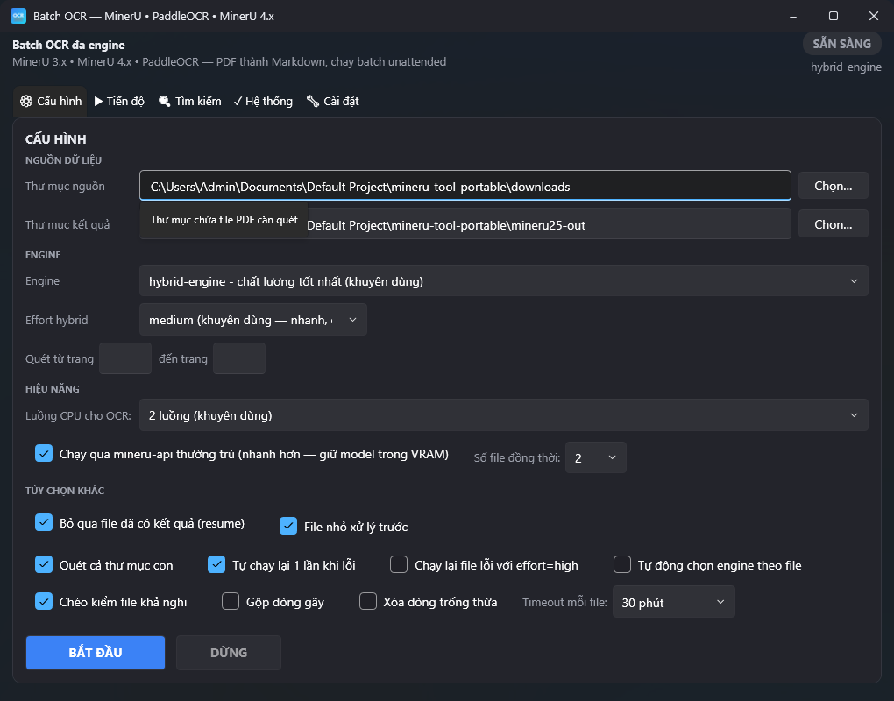

# MinerU25Tool — Multi-Engine Batch OCR for Windows

**[Tiếng Việt](README.vi.md)**

A Windows WPF (.NET 8) tool that batch-converts PDF files to Markdown with
multiple OCR engines, unattended batch runs (resume, pause, auto-shutdown),
Vietnamese/English UI and light/dark themes.




## Features

- **OCR engines**: `hybrid-engine` (recommended), `vlm-engine`, `pipeline` (PP-OCR),
  `vlm-http-client` / `hybrid-http-client` (remote GPU server),
  `paddleocr` (PP-StructureV3, light VRAM), `mineru4x` (MinerU 4.x resident server),
  `windows-ocr` (built-in WinRT OCR, free, CPU).
- **Batch**: 1–3 files in parallel via resident `mineru-api`, resume (`.done` markers),
  retry-on-failure (optional effort boost), per-file timeout, **pause/resume**,
  automatic quality check (flags SUSPICIOUS files + cross-checks with a 2nd engine).
- **Outputs**: `.md` + plain `.txt` (+ images, tables) per file, `batch-report.html`,
  `batch-log.txt`, `batch-state.json`.
- **Automation**: smart per-file engine routing (text/scan), watch folder
  (new PDFs run automatically), shutdown when done, sound notification,
  start-with-Windows.
- **Search**: full-text search across all scanned `.md` files.
- **System tab**: per-component checklist (red = required, yellow = optional),
  **install all or one-by-one** via pip/venvs automatically.
- **Interface**: 5 tabs (Config, Progress, Search, System, Settings), font size
  80–150%, background transparency, always-on-top, F1 help, CLI mode
  (`--autostart --src --out --engine`).

## Requirements

- Windows 10/11 x64. [.NET 8 SDK](https://dotnet.microsoft.com/download) (build only).
- Python 3.10+ for the engines — use the **System** tab → **Check** →
  **Auto-install** inside the app.
- NVIDIA GPU recommended (CPU works, much slower).

## Build & run

```powershell
dotnet build -c Release
dotnet publish -c Release -r win-x64 --self-contained true -p:PublishSingleFile=true -o publish
```

Launch `MinerU25Tool.exe`, open the **System** tab → **Check** → **Auto-install**
if anything is missing, pick a PDF folder and press **START**.
See [HUONG-DAN.txt](HUONG-DAN.txt) (Vietnamese) for detailed usage.

## Docs

- `HUONG-DAN.txt` — usage guide (Vietnamese).
- `HUONG-DAN-GPU-TU-XA.md` — run VLM on a rented remote GPU.
- `SOSANH-MINERU4-vs-345.md` — MinerU 4.x vs 3.4.5 comparison.
- `HUONG-DAN-DE-XUAT-OCR-ENGINES.md` — other OCR engines surveyed.

## Screenshots

| Config | Progress | Search |
|---|---|---|
|  |  |  |

| System | Settings | Dark mode |
|---|---|---|
|  |  |  |

## License

MIT — see [LICENSE](LICENSE).
